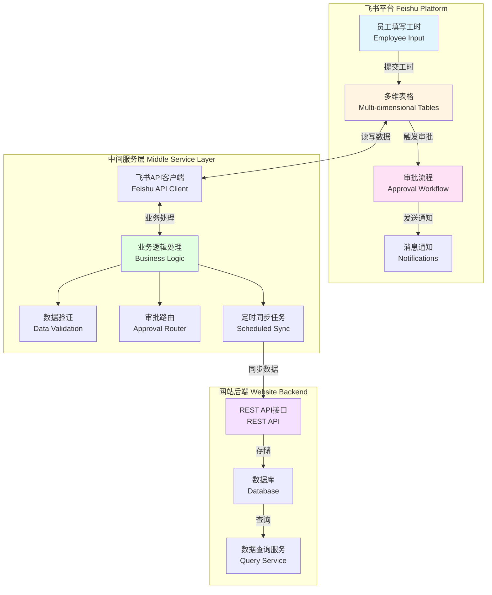
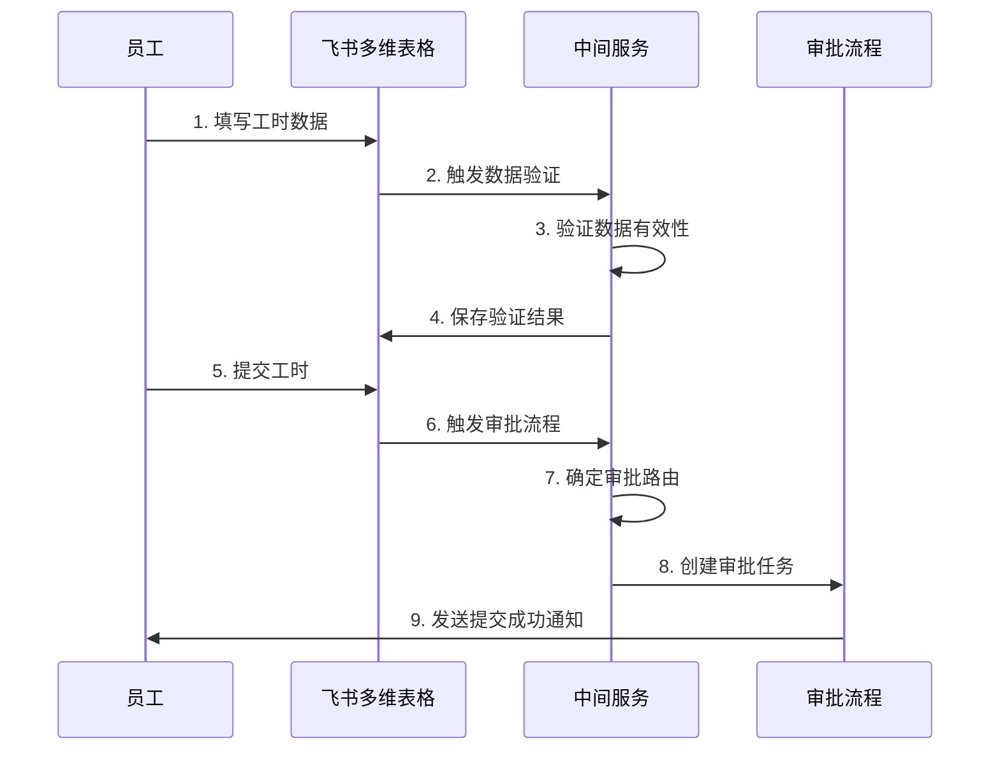
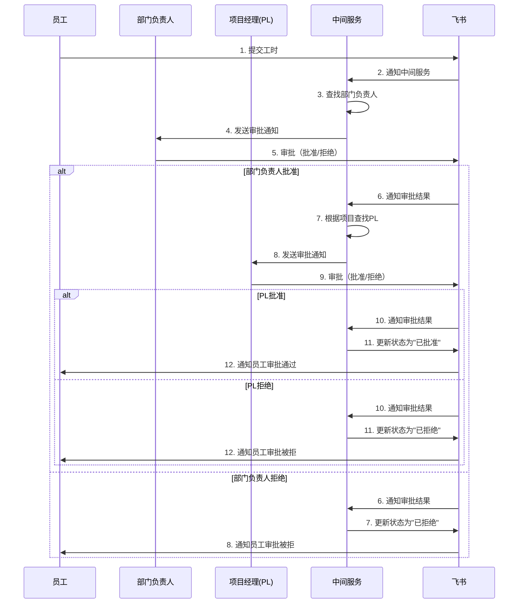
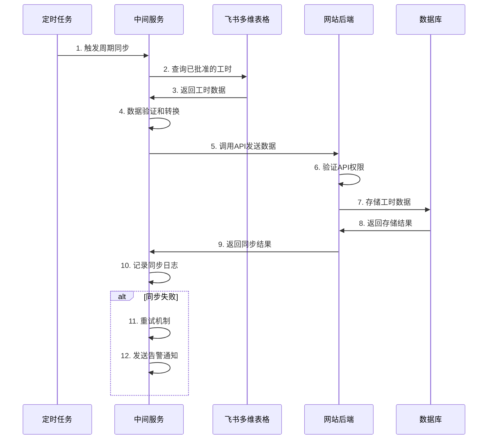
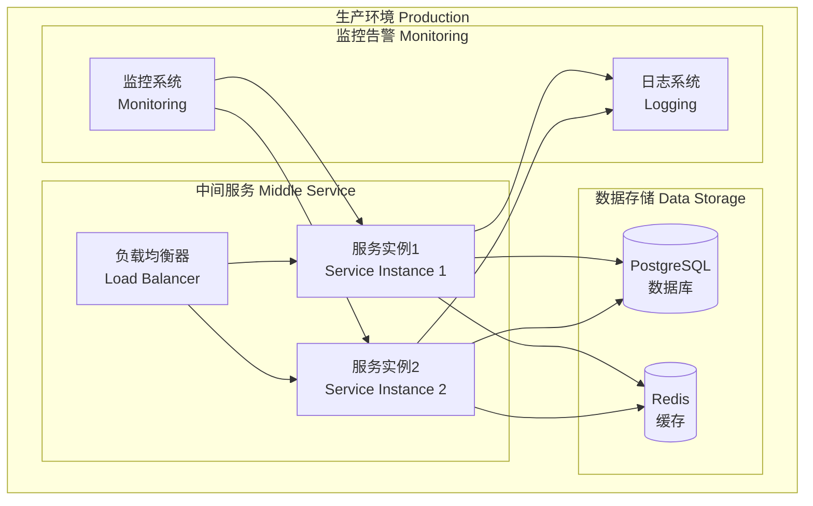
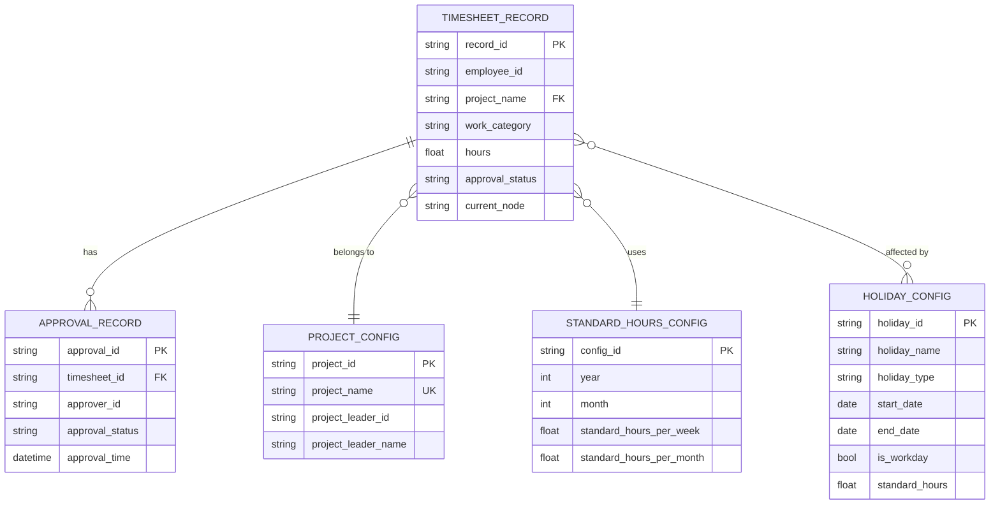

# 飞书工时管理自动化系统 - 技术设计文档

## 概述（Overview）

### 系统简介

飞书工时管理自动化系统是一个基于飞书平台的工时管理解决方案，旨在替代传统的Excel手工填报流程。系统通过飞书多维表格实现数据存储，通过飞书审批流程实现工时审批，通过中间服务层实现业务逻辑处理和数据同步。

### 核心目标

1. **简化工时填报**：员工通过飞书界面直接填写工时，无需手动维护Excel
2. **自动化审批流程**：工时提交后自动流转到部门负责人和项目经理进行审批
3. **数据自动同步**：已批准的工时数据定期自动同步到网站后端
4. **灵活的假期管理**：支持配置各类假期和调休，自动计算标准工时
5. **完整的数据追溯**：记录所有操作历史，支持审计和问题排查

### 系统组成部分

系统由三个主要部分组成：

1. **飞书平台**：提供用户界面、数据存储（多维表格）、审批流程、消息通知
2. **中间服务层**：处理业务逻辑、数据验证、审批路由、定时同步任务
3. **网站后端**：接收和存储工时数据，提供数据查询接口

### 技术术语解释（面向非技术用户）

- **API（应用程序接口）**：就像两个系统之间的"对话通道"，让它们可以互相传递信息
- **中间服务层**：连接飞书和网站的"桥梁"，负责处理复杂的业务规则
- **多维表格**：类似Excel的在线表格，但功能更强大，支持自动化操作
- **审批流程**：工时提交后需要经过的审批步骤，系统会自动把工时发给相应的审批人
- **数据同步**：把飞书中的工时数据自动复制到网站数据库的过程
- **REST API**：一种标准的系统间通信方式，就像"邮递员"传递信息
- **数据库**：存储数据的"仓库"，可以快速查询和管理大量数据


## 系统架构（Architecture）

### 整体架构图



### 架构说明

#### 1. 飞书平台层（用户交互层）

**作用**：这是员工和管理员直接使用的界面层

- **多维表格**：存储所有工时数据、项目配置、假期配置等
  - 就像一个在线的Excel，但更智能
  - 支持数据验证、自动计算、权限控制
  - 员工在这里填写工时信息

- **审批流程**：处理工时的审批
  - 自动把工时发给部门负责人
  - 部门负责人批准后，自动发给项目经理
  - 记录每一步的审批意见和时间

- **消息通知**：及时通知相关人员
  - 工时提交后通知审批人
  - 审批完成后通知员工
  - 异常情况通知管理员

#### 2. 中间服务层（业务处理层）

**作用**：这是系统的"大脑"，处理所有复杂的业务逻辑

- **飞书API客户端**：与飞书平台通信
  - 读取多维表格中的数据
  - 更新审批状态
  - 发送消息通知
  - 管理访问权限

- **业务逻辑处理**：实现核心业务规则
  - 验证工时数据是否符合规则
  - 计算标准工时（考虑假期和调休）
  - 确定审批路由（找到正确的审批人）
  - 处理审批结果

- **数据验证**：确保数据质量
  - 检查工时是否在合理范围内（0-8小时）
  - 验证项目名称是否存在
  - 确保必填字段都已填写
  - 检查日期格式是否正确

- **审批路由**：智能分配审批人
  - 根据员工所属部门找到部门负责人
  - 根据项目名称找到对应的项目经理
  - 处理多项目的审批分发

- **定时同步任务**：定期执行数据同步
  - 每周自动收集已批准的工时
  - 验证数据完整性
  - 将数据发送到网站后端
  - 记录同步日志

#### 3. 网站后端层（数据展示层）

**作用**：接收和存储工时数据，供网站展示使用

- **REST API接口**：提供数据访问接口
  - 接收中间服务层同步的数据
  - 提供数据查询接口
  - 验证API调用权限

- **数据库**：持久化存储工时数据
  - 存储已批准的工时记录
  - 支持按多种条件查询
  - 保证数据安全和完整性

- **数据查询服务**：处理数据查询请求
  - 按部门、员工、日期范围查询
  - 生成工时统计报表
  - 支持数据导出

### 数据流向

#### 工时提交流程




#### 审批流程



#### 数据同步流程



### 技术选型

#### 中间服务层技术栈

- **编程语言**：Python 3.9+
  - 原因：丰富的第三方库支持，易于维护
  - 飞书官方提供Python SDK

- **Web框架**：FastAPI
  - 原因：高性能、自动生成API文档、类型检查
  - 支持异步处理，提高并发性能

- **任务调度**：APScheduler
  - 原因：支持定时任务、灵活的调度策略
  - 可以配置周期同步任务

- **数据库**：PostgreSQL
  - 原因：可靠性高、支持复杂查询、事务支持
  - 用于存储中间服务的配置和日志

- **缓存**：Redis
  - 原因：高性能、支持多种数据结构
  - 用于缓存飞书访问令牌、减少API调用

- **日志**：Python logging + ELK Stack（可选）
  - 原因：结构化日志、便于查询和分析
  - 支持分布式日志收集

#### 网站后端技术栈

- **数据库**：MySQL/PostgreSQL
  - 原因：成熟稳定、支持大数据量
  - 用于存储工时数据

- **API接口**：REST API
  - 原因：标准化、易于集成
  - 支持多种客户端访问

### 部署架构



### 安全架构

1. **网络安全**
   - 所有通信使用HTTPS加密
   - API接口使用API Key认证
   - 限制IP访问白名单

2. **数据安全**
   - 敏感数据加密存储
   - 定期数据备份
   - 访问日志审计

3. **权限控制**
   - 基于角色的访问控制（RBAC）
   - 飞书OAuth认证
   - API权限验证


## 组件和接口（Components and Interfaces）

### 飞书多维表格设计

#### 1. 工时填报表（主表）

**表名**：`timesheet_records`

**用途**：员工填写和存储工时数据

**字段设计**：

| 字段名 | 字段类型 | 说明 | 是否必填 | 默认值 |
|--------|---------|------|---------|--------|
| record_id | 文本 | 工时记录唯一ID | 是 | 自动生成 |
| employee_id | 文本 | 员工ID（从飞书获取） | 是 | - |
| employee_name | 文本 | 员工姓名 | 是 | - |
| department | 文本 | 所属部门 | 是 | - |
| department_full_name | 文本 | 部门全称 | 是 | - |
| position | 文本 | 职位 | 是 | - |
| work_category | 单选 | 工作类别（项目工时/非项目工时） | 是 | - |
| project_name | 单选 | 项目名称（从项目配置表关联） | 条件必填 | - |
| non_project_category | 单选 | 非项目工时分类 | 条件必填 | - |
| start_date | 日期 | 开始日期 | 是 | - |
| end_date | 日期 | 结束日期 | 是 | - |
| hours | 数字 | 工时小时数（0-8） | 是 | - |
| task_detail | 多行文本 | 任务详情 | 是 | - |
| remark | 多行文本 | 备注 | 否 | - |
| approval_status | 单选 | 核准状态 | 是 | 草稿 |
| current_node | 文本 | 当前审批节点 | 是 | - |
| pending_approver | 文本 | 待审批人 | 否 | - |
| submit_time | 日期时间 | 提交时间 | 否 | - |
| version | 数字 | 版本号 | 是 | 1 |
| created_at | 日期时间 | 创建时间 | 是 | 自动 |
| updated_at | 日期时间 | 更新时间 | 是 | 自动 |

**字段说明**：

- `work_category`：项目工时、非项目工时
- `non_project_category`：Management、Others、Public Holiday、Timeoff、Training
- `approval_status`：草稿、待审批、已批准、已拒绝、已撤回
- `current_node`：Draft、Dept_Manager、PL、Close、Rejected
- 当选择"项目工时"时，`project_name`必填，`non_project_category`隐藏
- 当选择"非项目工时"时，`non_project_category`必填，`project_name`隐藏

**数据验证规则**：

```python
# 工时小时数验证
hours >= 0 and hours <= 8

# 日期验证
start_date <= end_date
start_date <= today + 7  # 不能填写超过7天后的日期

# 项目工时验证
if work_category == "项目工时":
    project_name is not None
    non_project_category is None

# 非项目工时验证
if work_category == "非项目工时":
    non_project_category is not None
    project_name is None
```

#### 2. 项目配置表

**表名**：`project_config`

**用途**：PM配置项目名称和PL的对应关系

**字段设计**：

| 字段名 | 字段类型 | 说明 | 是否必填 | 默认值 |
|--------|---------|------|---------|--------|
| project_id | 文本 | 项目唯一ID | 是 | 自动生成 |
| project_name | 文本 | 项目名称 | 是 | - |
| project_leader_id | 文本 | 项目经理ID | 是 | - |
| project_leader_name | 文本 | 项目经理姓名 | 是 | - |
| project_description | 多行文本 | 项目描述 | 否 | - |
| status | 单选 | 项目状态（活跃/已关闭） | 是 | 活跃 |
| created_by | 文本 | 创建人 | 是 | - |
| created_at | 日期时间 | 创建时间 | 是 | 自动 |
| updated_at | 日期时间 | 更新时间 | 是 | 自动 |

**数据验证规则**：

```python
# 项目名称唯一性验证
project_name is unique

# 项目经理存在性验证
project_leader_id exists in feishu_users
```

#### 3. 标准工时配置表

**表名**：`standard_hours_config`

**用途**：系统管理员配置周/月标准工时

**字段设计**：

| 字段名 | 字段类型 | 说明 | 是否必填 | 默认值 |
|--------|---------|------|---------|--------|
| config_id | 文本 | 配置唯一ID | 是 | 自动生成 |
| year | 数字 | 年份 | 是 | - |
| month | 数字 | 月份（1-12） | 否 | - |
| week_number | 数字 | 周数（1-53） | 否 | - |
| standard_hours_per_week | 数字 | 每周标准工时 | 是 | 40 |
| standard_hours_per_month | 数字 | 每月标准工时 | 是 | 160 |
| effective_date | 日期 | 生效日期 | 是 | - |
| created_by | 文本 | 创建人 | 是 | - |
| created_at | 日期时间 | 创建时间 | 是 | 自动 |
| updated_at | 日期时间 | 更新时间 | 是 | 自动 |

**数据验证规则**：

```python
# 年份验证
year >= 2024

# 月份验证
if month is not None:
    month >= 1 and month <= 12

# 周数验证
if week_number is not None:
    week_number >= 1 and week_number <= 53

# 标准工时验证
standard_hours_per_week > 0
standard_hours_per_month > 0
```

#### 4. 假期日历表

**表名**：`holiday_calendar`

**用途**：系统管理员配置假期和调休

**字段设计**：

| 字段名 | 字段类型 | 说明 | 是否必填 | 默认值 |
|--------|---------|------|---------|--------|
| holiday_id | 文本 | 假期唯一ID | 是 | 自动生成 |
| holiday_name | 文本 | 假期名称 | 是 | - |
| holiday_type | 单选 | 假期类型 | 是 | - |
| start_date | 日期 | 开始日期 | 是 | - |
| end_date | 日期 | 结束日期 | 是 | - |
| is_workday | 复选框 | 是否计入工作日 | 是 | false |
| standard_hours | 数字 | 该日标准工时 | 是 | 0 |
| year | 数字 | 年份 | 是 | - |
| created_by | 文本 | 创建人 | 是 | - |
| created_at | 日期时间 | 创建时间 | 是 | 自动 |
| updated_at | 日期时间 | 更新时间 | 是 | 自动 |

**字段说明**：

- `holiday_type`：国家法定假日、年假、病假、事假、婚假、丧假、产假、调休、补班
- `is_workday`：false表示假期（不工作），true表示调休/补班（需要工作）
- `standard_hours`：假期为0，调休/补班为8

**数据验证规则**：

```python
# 日期验证
start_date <= end_date

# 标准工时验证
if is_workday == false:
    standard_hours == 0
if is_workday == true:
    standard_hours == 8

# 年份验证
year >= 2024
```


### 中间服务层组件设计

#### 1. 飞书API客户端（FeishuAPIClient）

**职责**：封装所有与飞书平台的交互

**主要方法**：

```python
class FeishuAPIClient:
    """飞书API客户端"""
    
    def __init__(self, app_id: str, app_secret: str):
        """初始化客户端"""
        self.app_id = app_id
        self.app_secret = app_secret
        self.access_token = None
        self.token_expire_time = None
    
    def get_access_token(self) -> str:
        """获取访问令牌（带缓存）"""
        # 如果令牌未过期，直接返回缓存的令牌
        # 否则调用飞书API获取新令牌
        pass
    
    def get_table_records(self, app_token: str, table_id: str, 
                         filter_condition: dict = None) -> list:
        """查询多维表格记录"""
        # 调用飞书API查询表格数据
        # 支持过滤条件
        pass
    
    def create_table_record(self, app_token: str, table_id: str, 
                           fields: dict) -> str:
        """创建多维表格记录"""
        # 调用飞书API创建记录
        # 返回记录ID
        pass
    
    def update_table_record(self, app_token: str, table_id: str, 
                           record_id: str, fields: dict) -> bool:
        """更新多维表格记录"""
        # 调用飞书API更新记录
        pass
    
    def send_message(self, user_id: str, message: str) -> bool:
        """发送消息通知"""
        # 调用飞书API发送消息
        pass
    
    def get_user_info(self, user_id: str) -> dict:
        """获取用户信息"""
        # 调用飞书API获取用户详情
        pass
    
    def get_department_info(self, department_id: str) -> dict:
        """获取部门信息"""
        # 调用飞书API获取部门详情
        # 包括部门负责人信息
        pass
```

**错误处理**：

```python
# 指数退避重试机制
def retry_with_exponential_backoff(func, max_retries=3):
    """指数退避重试装饰器"""
    delay = 1  # 初始延迟1秒
    for attempt in range(max_retries):
        try:
            return func()
        except Exception as e:
            if attempt == max_retries - 1:
                raise
            time.sleep(delay)
            delay = min(delay * 2, 60)  # 最大延迟60秒
```

#### 2. 数据验证服务（ValidationService）

**职责**：验证工时数据的有效性

**主要方法**：

```python
class ValidationService:
    """数据验证服务"""
    
    def validate_timesheet(self, timesheet: dict) -> tuple[bool, list]:
        """验证工时记录
        
        Returns:
            (is_valid, error_messages)
        """
        errors = []
        
        # 验证必填字段
        if not self._validate_required_fields(timesheet):
            errors.append("缺少必填字段")
        
        # 验证工时范围
        if not self._validate_hours_range(timesheet['hours']):
            errors.append("工时必须在0-8小时之间")
        
        # 验证日期
        if not self._validate_dates(timesheet['start_date'], 
                                    timesheet['end_date']):
            errors.append("日期格式或范围不正确")
        
        # 验证工作类别
        if not self._validate_work_category(timesheet):
            errors.append("工作类别配置不正确")
        
        return len(errors) == 0, errors
    
    def _validate_required_fields(self, timesheet: dict) -> bool:
        """验证必填字段"""
        required_fields = [
            'employee_id', 'employee_name', 'department',
            'work_category', 'start_date', 'end_date', 
            'hours', 'task_detail'
        ]
        return all(field in timesheet and timesheet[field] 
                  for field in required_fields)
    
    def _validate_hours_range(self, hours: float) -> bool:
        """验证工时范围"""
        return 0 <= hours <= 8
    
    def _validate_dates(self, start_date: str, end_date: str) -> bool:
        """验证日期"""
        try:
            start = datetime.strptime(start_date, '%Y-%m-%d')
            end = datetime.strptime(end_date, '%Y-%m-%d')
            today = datetime.now()
            
            # 开始日期不能晚于结束日期
            if start > end:
                return False
            
            # 不能填写超过7天后的日期
            if start > today + timedelta(days=7):
                return False
            
            return True
        except ValueError:
            return False
    
    def _validate_work_category(self, timesheet: dict) -> bool:
        """验证工作类别"""
        work_category = timesheet.get('work_category')
        
        if work_category == '项目工时':
            # 项目工时必须有项目名称
            return 'project_name' in timesheet and timesheet['project_name']
        elif work_category == '非项目工时':
            # 非项目工时必须有非项目分类
            return ('non_project_category' in timesheet and 
                   timesheet['non_project_category'])
        
        return False
    
    def validate_weekly_hours(self, employee_id: str, week_start: str,
                             new_hours: float) -> tuple[bool, str]:
        """验证周工时总和"""
        # 查询该员工本周已填报的工时
        existing_hours = self._get_weekly_hours(employee_id, week_start)
        
        # 获取本周标准工时
        standard_hours = self._get_standard_hours(week_start)
        
        # 验证总工时不超过标准工时的150%
        total_hours = existing_hours + new_hours
        max_hours = standard_hours * 1.5
        
        if total_hours > max_hours:
            return False, f"本周工时总和({total_hours})超过限制({max_hours})"
        
        return True, ""
```

#### 3. 审批路由服务（ApprovalRouterService）

**职责**：确定工时的审批路径和审批人

**主要方法**：

```python
class ApprovalRouterService:
    """审批路由服务"""
    
    def __init__(self, feishu_client: FeishuAPIClient):
        self.feishu_client = feishu_client
    
    def get_approval_chain(self, timesheet: dict) -> list:
        """获取审批链
        
        Returns:
            审批人列表，按审批顺序排列
            [
                {'role': 'dept_manager', 'user_id': 'xxx', 'name': 'xxx'},
                {'role': 'project_leader', 'user_id': 'yyy', 'name': 'yyy'}
            ]
        """
        chain = []
        
        # 1. 获取部门负责人
        dept_manager = self._get_department_manager(
            timesheet['department']
        )
        chain.append({
            'role': 'dept_manager',
            'user_id': dept_manager['user_id'],
            'name': dept_manager['name']
        })
        
        # 2. 获取项目经理（如果是项目工时）
        if timesheet['work_category'] == '项目工时':
            project_leader = self._get_project_leader(
                timesheet['project_name']
            )
            chain.append({
                'role': 'project_leader',
                'user_id': project_leader['user_id'],
                'name': project_leader['name']
            })
        
        return chain
    
    def _get_department_manager(self, department: str) -> dict:
        """获取部门负责人"""
        # 从飞书组织架构获取部门信息
        dept_info = self.feishu_client.get_department_info(department)
        return {
            'user_id': dept_info['leader_user_id'],
            'name': dept_info['leader_name']
        }
    
    def _get_project_leader(self, project_name: str) -> dict:
        """获取项目经理"""
        # 从项目配置表查询
        project_config = self._query_project_config(project_name)
        return {
            'user_id': project_config['project_leader_id'],
            'name': project_config['project_leader_name']
        }
    
    def route_to_next_approver(self, timesheet_id: str, 
                               current_approver_role: str) -> dict:
        """路由到下一个审批人"""
        # 获取工时记录
        timesheet = self._get_timesheet(timesheet_id)
        
        # 获取审批链
        approval_chain = self.get_approval_chain(timesheet)
        
        # 找到当前审批人在链中的位置
        current_index = next(
            (i for i, approver in enumerate(approval_chain) 
             if approver['role'] == current_approver_role),
            -1
        )
        
        # 返回下一个审批人
        if current_index >= 0 and current_index < len(approval_chain) - 1:
            return approval_chain[current_index + 1]
        
        # 已经是最后一个审批人，返回None表示审批完成
        return None
```


#### 4. 审批处理服务（ApprovalService）

**职责**：处理审批流程的业务逻辑

**主要方法**：

```python
class ApprovalService:
    """审批处理服务"""
    
    def __init__(self, feishu_client: FeishuAPIClient, 
                 router: ApprovalRouterService):
        self.feishu_client = feishu_client
        self.router = router
    
    def submit_for_approval(self, timesheet_id: str) -> bool:
        """提交工时进入审批流程"""
        # 1. 获取工时记录
        timesheet = self._get_timesheet(timesheet_id)
        
        # 2. 获取审批链
        approval_chain = self.router.get_approval_chain(timesheet)
        
        # 3. 更新工时状态
        self._update_timesheet_status(
            timesheet_id,
            approval_status='待审批',
            current_node='Dept_Manager',
            pending_approver=approval_chain[0]['user_id']
        )
        
        # 4. 发送通知给第一个审批人（部门负责人）
        self._send_approval_notification(
            approval_chain[0]['user_id'],
            timesheet
        )
        
        return True
    
    def approve(self, timesheet_id: str, approver_id: str, 
                comment: str = "") -> bool:
        """批准工时"""
        # 1. 获取工时记录
        timesheet = self._get_timesheet(timesheet_id)
        
        # 2. 验证审批人权限
        if not self._verify_approver(timesheet, approver_id):
            raise PermissionError("无权审批此工时")
        
        # 3. 记录审批意见
        self._record_approval(timesheet_id, approver_id, 
                             'approved', comment)
        
        # 4. 路由到下一个审批人
        current_role = self._get_approver_role(timesheet, approver_id)
        next_approver = self.router.route_to_next_approver(
            timesheet_id, current_role
        )
        
        if next_approver:
            # 还有下一级审批
            self._update_timesheet_status(
                timesheet_id,
                current_node=self._get_node_name(next_approver['role']),
                pending_approver=next_approver['user_id']
            )
            
            # 发送通知给下一个审批人
            self._send_approval_notification(
                next_approver['user_id'],
                timesheet
            )
        else:
            # 审批完成
            self._update_timesheet_status(
                timesheet_id,
                approval_status='已批准',
                current_node='Close',
                pending_approver=None
            )
            
            # 通知员工审批通过
            self._send_approval_result_notification(
                timesheet['employee_id'],
                timesheet,
                'approved'
            )
        
        return True
    
    def reject(self, timesheet_id: str, approver_id: str, 
               reason: str, return_to: str = 'employee') -> bool:
        """拒绝工时
        
        Args:
            return_to: 'employee' 或 'dept_manager'
        """
        # 1. 获取工时记录
        timesheet = self._get_timesheet(timesheet_id)
        
        # 2. 验证审批人权限
        if not self._verify_approver(timesheet, approver_id):
            raise PermissionError("无权审批此工时")
        
        # 3. 记录审批意见
        self._record_approval(timesheet_id, approver_id, 
                             'rejected', reason)
        
        # 4. 更新工时状态
        if return_to == 'employee':
            self._update_timesheet_status(
                timesheet_id,
                approval_status='已拒绝',
                current_node='Rejected',
                pending_approver=timesheet['employee_id']
            )
        else:  # return_to == 'dept_manager'
            dept_manager = self.router._get_department_manager(
                timesheet['department']
            )
            self._update_timesheet_status(
                timesheet_id,
                approval_status='待审批',
                current_node='Dept_Manager',
                pending_approver=dept_manager['user_id']
            )
        
        # 5. 通知相关人员
        self._send_approval_result_notification(
            timesheet['employee_id'],
            timesheet,
            'rejected',
            reason
        )
        
        return True
```

#### 5. 数据同步服务（SyncService）

**职责**：定期同步工时数据到网站后端

**主要方法**：

```python
class SyncService:
    """数据同步服务"""
    
    def __init__(self, feishu_client: FeishuAPIClient, 
                 website_api_client: WebsiteAPIClient):
        self.feishu_client = feishu_client
        self.website_api = website_api_client
    
    def sync_approved_timesheets(self, start_date: str, 
                                end_date: str) -> dict:
        """同步已批准的工时数据
        
        Returns:
            同步结果统计
        """
        result = {
            'success': False,
            'total_records': 0,
            'synced_records': 0,
            'failed_records': 0,
            'errors': []
        }
        
        try:
            # 1. 查询已批准的工时记录
            timesheets = self._query_approved_timesheets(
                start_date, end_date
            )
            result['total_records'] = len(timesheets)
            
            # 2. 数据转换和验证
            transformed_data = []
            for timesheet in timesheets:
                try:
                    data = self._transform_timesheet_data(timesheet)
                    if self._validate_sync_data(data):
                        transformed_data.append(data)
                    else:
                        result['failed_records'] += 1
                        result['errors'].append(
                            f"数据验证失败: {timesheet['record_id']}"
                        )
                except Exception as e:
                    result['failed_records'] += 1
                    result['errors'].append(
                        f"数据转换失败: {timesheet['record_id']}, {str(e)}"
                    )
            
            # 3. 批量发送到网站后端
            if transformed_data:
                sync_response = self.website_api.batch_create_timesheets(
                    transformed_data
                )
                
                if sync_response['success']:
                    result['synced_records'] = len(transformed_data)
                    result['success'] = True
                else:
                    result['errors'].append(
                        f"网站API调用失败: {sync_response['message']}"
                    )
            
            # 4. 记录同步日志
            self._log_sync_result(result)
            
            # 5. 发送同步结果通知
            self._send_sync_notification(result)
            
        except Exception as e:
            result['errors'].append(f"同步过程异常: {str(e)}")
            self._log_error(e)
        
        return result
    
    def _query_approved_timesheets(self, start_date: str, 
                                   end_date: str) -> list:
        """查询已批准的工时记录"""
        filter_condition = {
            'approval_status': '已批准',
            'current_node': 'Close',
            'start_date': {'>=': start_date},
            'end_date': {'<=': end_date}
        }
        
        return self.feishu_client.get_table_records(
            app_token=TIMESHEET_APP_TOKEN,
            table_id=TIMESHEET_TABLE_ID,
            filter_condition=filter_condition
        )
    
    def _transform_timesheet_data(self, timesheet: dict) -> dict:
        """转换工时数据格式"""
        # 获取项目经理信息（如果是项目工时）
        project_leader = None
        if timesheet['work_category'] == '项目工时':
            project_config = self._get_project_config(
                timesheet['project_name']
            )
            project_leader = project_config['project_leader_name']
        
        # 判断是否计入人月占比
        count_in_manmonth = self._should_count_in_manmonth(timesheet)
        
        return {
            'employee_id': timesheet['employee_id'],
            'employee_name': timesheet['employee_name'],
            'department': timesheet['department'],
            'date': timesheet['start_date'],
            'hours': timesheet['hours'],
            'approval_status': timesheet['approval_status'],
            'project_name': timesheet.get('project_name'),
            'project_leader': project_leader,
            'work_category': timesheet['work_category'],
            'non_project_category': timesheet.get('non_project_category'),
            'count_in_manmonth': count_in_manmonth,
            'task_detail': timesheet['task_detail'],
            'version': timesheet['version'],
            'synced_at': datetime.now().isoformat()
        }
    
    def _should_count_in_manmonth(self, timesheet: dict) -> bool:
        """判断是否计入人月占比"""
        if timesheet['work_category'] == '项目工时':
            return True
        
        # 非项目工时中，Management、Others、Training计入
        # Public Holiday、Timeoff不计入
        non_project_category = timesheet.get('non_project_category')
        return non_project_category in ['Management', 'Others', 'Training']
    
    def _validate_sync_data(self, data: dict) -> bool:
        """验证同步数据"""
        required_fields = [
            'employee_id', 'employee_name', 'department',
            'date', 'hours', 'work_category'
        ]
        return all(field in data and data[field] is not None 
                  for field in required_fields)
```


#### 6. 定时任务调度器（SchedulerService）

**职责**：管理和执行定时任务

**主要方法**：

```python
from apscheduler.schedulers.asyncio import AsyncIOScheduler
from apscheduler.triggers.cron import CronTrigger

class SchedulerService:
    """定时任务调度器"""
    
    def __init__(self, sync_service: SyncService):
        self.scheduler = AsyncIOScheduler()
        self.sync_service = sync_service
    
    def start(self):
        """启动调度器"""
        # 每周一凌晨2点执行周期同步
        self.scheduler.add_job(
            self._weekly_sync_job,
            trigger=CronTrigger(day_of_week='mon', hour=2, minute=0),
            id='weekly_sync',
            name='周期工时同步',
            replace_existing=True
        )
        
        # 每天凌晨3点执行数据备份
        self.scheduler.add_job(
            self._daily_backup_job,
            trigger=CronTrigger(hour=3, minute=0),
            id='daily_backup',
            name='每日数据备份',
            replace_existing=True
        )
        
        self.scheduler.start()
    
    async def _weekly_sync_job(self):
        """周期同步任务"""
        # 计算上周的日期范围
        today = datetime.now()
        last_monday = today - timedelta(days=today.weekday() + 7)
        last_sunday = last_monday + timedelta(days=6)
        
        start_date = last_monday.strftime('%Y-%m-%d')
        end_date = last_sunday.strftime('%Y-%m-%d')
        
        # 执行同步
        result = self.sync_service.sync_approved_timesheets(
            start_date, end_date
        )
        
        # 如果同步失败，重试
        if not result['success']:
            await self._retry_sync(start_date, end_date, max_retries=3)
    
    async def _retry_sync(self, start_date: str, end_date: str, 
                         max_retries: int = 3):
        """重试同步"""
        for attempt in range(max_retries):
            await asyncio.sleep(60 * (attempt + 1))  # 延迟重试
            
            result = self.sync_service.sync_approved_timesheets(
                start_date, end_date
            )
            
            if result['success']:
                return
        
        # 重试失败，发送告警
        self._send_alert(
            f"周期同步失败，已重试{max_retries}次"
        )
    
    def stop(self):
        """停止调度器"""
        self.scheduler.shutdown()
```

### 网站后端API接口设计

#### API认证

所有API请求需要在HTTP Header中包含API密钥：

```
Authorization: Bearer <API_KEY>
```

#### 1. 批量创建工时记录

**接口**：`POST /api/v1/timesheets/batch`

**请求体**：

```json
{
  "timesheets": [
    {
      "employee_id": "emp001",
      "employee_name": "张三",
      "department": "技术部",
      "date": "2024-01-15",
      "hours": 8.0,
      "approval_status": "已批准",
      "project_name": "项目A",
      "project_leader": "李四",
      "work_category": "项目工时",
      "non_project_category": null,
      "count_in_manmonth": true,
      "task_detail": "开发功能模块",
      "version": 1,
      "synced_at": "2024-01-22T02:00:00Z"
    }
  ]
}
```

**响应**：

```json
{
  "success": true,
  "message": "批量创建成功",
  "data": {
    "created_count": 1,
    "failed_count": 0,
    "errors": []
  }
}
```

#### 2. 查询工时记录

**接口**：`GET /api/v1/timesheets`

**查询参数**：

- `start_date`: 开始日期（YYYY-MM-DD）
- `end_date`: 结束日期（YYYY-MM-DD）
- `department_id`: 部门ID（可选）
- `employee_id`: 员工ID（可选）
- `status`: 审批状态（可选）
- `page`: 页码（默认1）
- `page_size`: 每页记录数（默认100，最大100）

**响应**：

```json
{
  "success": true,
  "data": {
    "total": 150,
    "page": 1,
    "page_size": 100,
    "records": [
      {
        "id": "ts001",
        "employee_id": "emp001",
        "employee_name": "张三",
        "department": "技术部",
        "date": "2024-01-15",
        "hours": 8.0,
        "approval_status": "已批准",
        "project_name": "项目A",
        "project_leader": "李四",
        "work_category": "项目工时",
        "created_at": "2024-01-15T10:00:00Z",
        "updated_at": "2024-01-15T15:00:00Z"
      }
    ]
  }
}
```

#### 3. 查询单条工时记录

**接口**：`GET /api/v1/timesheets/{id}`

**响应**：

```json
{
  "success": true,
  "data": {
    "id": "ts001",
    "employee_id": "emp001",
    "employee_name": "张三",
    "department": "技术部",
    "date": "2024-01-15",
    "hours": 8.0,
    "approval_status": "已批准",
    "project_name": "项目A",
    "project_leader": "李四",
    "work_category": "项目工时",
    "task_detail": "开发功能模块",
    "version": 1,
    "created_at": "2024-01-15T10:00:00Z",
    "updated_at": "2024-01-15T15:00:00Z"
  }
}
```

#### 4. 查询部门列表

**接口**：`GET /api/v1/departments`

**响应**：

```json
{
  "success": true,
  "data": [
    {
      "department_id": "dept001",
      "department_name": "技术部",
      "manager_name": "王五"
    }
  ]
}
```

#### 5. 查询假期配置

**接口**：`GET /api/v1/holidays`

**查询参数**：

- `year`: 年份（必填）
- `month`: 月份（可选）

**响应**：

```json
{
  "success": true,
  "data": [
    {
      "holiday_id": "h001",
      "holiday_name": "春节",
      "holiday_type": "国家法定假日",
      "start_date": "2024-02-10",
      "end_date": "2024-02-17",
      "is_workday": false,
      "standard_hours": 0
    }
  ]
}
```

#### 错误响应格式

```json
{
  "success": false,
  "error": {
    "code": "INVALID_REQUEST",
    "message": "请求参数不正确",
    "details": "start_date格式错误，应为YYYY-MM-DD"
  }
}
```

**错误码列表**：

- `UNAUTHORIZED`: 未授权（401）
- `FORBIDDEN`: 禁止访问（403）
- `NOT_FOUND`: 资源不存在（404）
- `INVALID_REQUEST`: 请求参数错误（400）
- `INTERNAL_ERROR`: 服务器内部错误（500）


## 数据模型（Data Models）

### 核心数据模型

#### 1. 工时记录模型（TimesheetRecord）

```python
from dataclasses import dataclass
from datetime import datetime
from typing import Optional

@dataclass
class TimesheetRecord:
    """工时记录数据模型"""
    
    # 基本信息
    record_id: str
    employee_id: str
    employee_name: str
    department: str
    department_full_name: str
    position: str
    
    # 工时信息
    work_category: str  # '项目工时' 或 '非项目工时'
    project_name: Optional[str] = None
    non_project_category: Optional[str] = None
    start_date: str  # YYYY-MM-DD
    end_date: str  # YYYY-MM-DD
    hours: float
    task_detail: str
    remark: Optional[str] = None
    
    # 审批信息
    approval_status: str  # '草稿', '待审批', '已批准', '已拒绝', '已撤回'
    current_node: str  # 'Draft', 'Dept_Manager', 'PL', 'Close', 'Rejected'
    pending_approver: Optional[str] = None
    
    # 元数据
    submit_time: Optional[datetime] = None
    version: int = 1
    created_at: datetime = None
    updated_at: datetime = None
    
    def validate(self) -> tuple[bool, list[str]]:
        """验证数据有效性"""
        errors = []
        
        # 验证工时范围
        if not (0 <= self.hours <= 8):
            errors.append("工时必须在0-8小时之间")
        
        # 验证工作类别
        if self.work_category == '项目工时':
            if not self.project_name:
                errors.append("项目工时必须指定项目名称")
        elif self.work_category == '非项目工时':
            if not self.non_project_category:
                errors.append("非项目工时必须指定分类")
        else:
            errors.append("工作类别必须是'项目工时'或'非项目工时'")
        
        # 验证日期
        try:
            start = datetime.strptime(self.start_date, '%Y-%m-%d')
            end = datetime.strptime(self.end_date, '%Y-%m-%d')
            if start > end:
                errors.append("开始日期不能晚于结束日期")
        except ValueError:
            errors.append("日期格式不正确，应为YYYY-MM-DD")
        
        return len(errors) == 0, errors
    
    def to_dict(self) -> dict:
        """转换为字典"""
        return {
            'record_id': self.record_id,
            'employee_id': self.employee_id,
            'employee_name': self.employee_name,
            'department': self.department,
            'department_full_name': self.department_full_name,
            'position': self.position,
            'work_category': self.work_category,
            'project_name': self.project_name,
            'non_project_category': self.non_project_category,
            'start_date': self.start_date,
            'end_date': self.end_date,
            'hours': self.hours,
            'task_detail': self.task_detail,
            'remark': self.remark,
            'approval_status': self.approval_status,
            'current_node': self.current_node,
            'pending_approver': self.pending_approver,
            'submit_time': self.submit_time.isoformat() if self.submit_time else None,
            'version': self.version,
            'created_at': self.created_at.isoformat() if self.created_at else None,
            'updated_at': self.updated_at.isoformat() if self.updated_at else None
        }
```

#### 2. 项目配置模型（ProjectConfig）

```python
@dataclass
class ProjectConfig:
    """项目配置数据模型"""
    
    project_id: str
    project_name: str
    project_leader_id: str
    project_leader_name: str
    project_description: Optional[str] = None
    status: str = '活跃'  # '活跃' 或 '已关闭'
    created_by: str = None
    created_at: datetime = None
    updated_at: datetime = None
    
    def validate(self) -> tuple[bool, list[str]]:
        """验证数据有效性"""
        errors = []
        
        if not self.project_name:
            errors.append("项目名称不能为空")
        
        if not self.project_leader_id:
            errors.append("项目经理ID不能为空")
        
        if not self.project_leader_name:
            errors.append("项目经理姓名不能为空")
        
        return len(errors) == 0, errors
    
    def to_dict(self) -> dict:
        """转换为字典"""
        return {
            'project_id': self.project_id,
            'project_name': self.project_name,
            'project_leader_id': self.project_leader_id,
            'project_leader_name': self.project_leader_name,
            'project_description': self.project_description,
            'status': self.status,
            'created_by': self.created_by,
            'created_at': self.created_at.isoformat() if self.created_at else None,
            'updated_at': self.updated_at.isoformat() if self.updated_at else None
        }
```

#### 3. 标准工时配置模型（StandardHoursConfig）

```python
@dataclass
class StandardHoursConfig:
    """标准工时配置数据模型"""
    
    config_id: str
    year: int
    month: Optional[int] = None
    week_number: Optional[int] = None
    standard_hours_per_week: float = 40.0
    standard_hours_per_month: float = 160.0
    effective_date: str = None  # YYYY-MM-DD
    created_by: str = None
    created_at: datetime = None
    updated_at: datetime = None
    
    def validate(self) -> tuple[bool, list[str]]:
        """验证数据有效性"""
        errors = []
        
        if self.year < 2024:
            errors.append("年份必须大于等于2024")
        
        if self.month is not None and not (1 <= self.month <= 12):
            errors.append("月份必须在1-12之间")
        
        if self.week_number is not None and not (1 <= self.week_number <= 53):
            errors.append("周数必须在1-53之间")
        
        if self.standard_hours_per_week <= 0:
            errors.append("每周标准工时必须大于0")
        
        if self.standard_hours_per_month <= 0:
            errors.append("每月标准工时必须大于0")
        
        return len(errors) == 0, errors
    
    def to_dict(self) -> dict:
        """转换为字典"""
        return {
            'config_id': self.config_id,
            'year': self.year,
            'month': self.month,
            'week_number': self.week_number,
            'standard_hours_per_week': self.standard_hours_per_week,
            'standard_hours_per_month': self.standard_hours_per_month,
            'effective_date': self.effective_date,
            'created_by': self.created_by,
            'created_at': self.created_at.isoformat() if self.created_at else None,
            'updated_at': self.updated_at.isoformat() if self.updated_at else None
        }
```

#### 4. 假期配置模型（HolidayConfig）

```python
@dataclass
class HolidayConfig:
    """假期配置数据模型"""
    
    holiday_id: str
    holiday_name: str
    holiday_type: str  # 国家法定假日、年假、病假、事假、婚假、丧假、产假、调休、补班
    start_date: str  # YYYY-MM-DD
    end_date: str  # YYYY-MM-DD
    is_workday: bool = False
    standard_hours: float = 0.0
    year: int = None
    created_by: str = None
    created_at: datetime = None
    updated_at: datetime = None
    
    def validate(self) -> tuple[bool, list[str]]:
        """验证数据有效性"""
        errors = []
        
        # 验证日期
        try:
            start = datetime.strptime(self.start_date, '%Y-%m-%d')
            end = datetime.strptime(self.end_date, '%Y-%m-%d')
            if start > end:
                errors.append("开始日期不能晚于结束日期")
        except ValueError:
            errors.append("日期格式不正确，应为YYYY-MM-DD")
        
        # 验证标准工时
        if not self.is_workday and self.standard_hours != 0:
            errors.append("假期的标准工时应为0")
        
        if self.is_workday and self.standard_hours != 8:
            errors.append("调休/补班的标准工时应为8")
        
        return len(errors) == 0, errors
    
    def to_dict(self) -> dict:
        """转换为字典"""
        return {
            'holiday_id': self.holiday_id,
            'holiday_name': self.holiday_name,
            'holiday_type': self.holiday_type,
            'start_date': self.start_date,
            'end_date': self.end_date,
            'is_workday': self.is_workday,
            'standard_hours': self.standard_hours,
            'year': self.year,
            'created_by': self.created_by,
            'created_at': self.created_at.isoformat() if self.created_at else None,
            'updated_at': self.updated_at.isoformat() if self.updated_at else None
        }
```

#### 5. 审批记录模型（ApprovalRecord）

```python
@dataclass
class ApprovalRecord:
    """审批记录数据模型"""
    
    approval_id: str
    timesheet_id: str
    approver_id: str
    approver_name: str
    approver_role: str  # 'dept_manager' 或 'project_leader'
    approval_time: datetime
    approval_status: str  # 'approved' 或 'rejected'
    approval_comment: Optional[str] = None
    created_at: datetime = None
    
    def to_dict(self) -> dict:
        """转换为字典"""
        return {
            'approval_id': self.approval_id,
            'timesheet_id': self.timesheet_id,
            'approver_id': self.approver_id,
            'approver_name': self.approver_name,
            'approver_role': self.approver_role,
            'approval_time': self.approval_time.isoformat(),
            'approval_status': self.approval_status,
            'approval_comment': self.approval_comment,
            'created_at': self.created_at.isoformat() if self.created_at else None
        }
```

### 数据库表设计（中间服务层）

#### 1. 同步日志表（sync_logs）

```sql
CREATE TABLE sync_logs (
    id SERIAL PRIMARY KEY,
    sync_type VARCHAR(50) NOT NULL,  -- 'weekly', 'manual'
    start_date DATE NOT NULL,
    end_date DATE NOT NULL,
    total_records INTEGER NOT NULL,
    synced_records INTEGER NOT NULL,
    failed_records INTEGER NOT NULL,
    success BOOLEAN NOT NULL,
    error_message TEXT,
    started_at TIMESTAMP NOT NULL,
    completed_at TIMESTAMP,
    created_at TIMESTAMP DEFAULT CURRENT_TIMESTAMP
);

CREATE INDEX idx_sync_logs_start_date ON sync_logs(start_date);
CREATE INDEX idx_sync_logs_created_at ON sync_logs(created_at);
```

#### 2. 审批日志表（approval_logs）

```sql
CREATE TABLE approval_logs (
    id SERIAL PRIMARY KEY,
    timesheet_id VARCHAR(100) NOT NULL,
    approver_id VARCHAR(100) NOT NULL,
    approver_name VARCHAR(200) NOT NULL,
    approver_role VARCHAR(50) NOT NULL,
    approval_status VARCHAR(20) NOT NULL,  -- 'approved', 'rejected'
    approval_comment TEXT,
    approval_time TIMESTAMP NOT NULL,
    created_at TIMESTAMP DEFAULT CURRENT_TIMESTAMP
);

CREATE INDEX idx_approval_logs_timesheet_id ON approval_logs(timesheet_id);
CREATE INDEX idx_approval_logs_approver_id ON approval_logs(approver_id);
CREATE INDEX idx_approval_logs_approval_time ON approval_logs(approval_time);
```

#### 3. 系统配置表（system_config）

```sql
CREATE TABLE system_config (
    id SERIAL PRIMARY KEY,
    config_key VARCHAR(100) UNIQUE NOT NULL,
    config_value TEXT NOT NULL,
    description TEXT,
    created_at TIMESTAMP DEFAULT CURRENT_TIMESTAMP,
    updated_at TIMESTAMP DEFAULT CURRENT_TIMESTAMP
);

-- 插入默认配置
INSERT INTO system_config (config_key, config_value, description) VALUES
('feishu_app_id', '', '飞书应用ID'),
('feishu_app_secret', '', '飞书应用密钥'),
('website_api_url', '', '网站后端API地址'),
('website_api_key', '', '网站后端API密钥'),
('sync_enabled', 'true', '是否启用自动同步'),
('sync_cron', '0 2 * * 1', '同步任务Cron表达式');
```

#### 4. 错误日志表（error_logs）

```sql
CREATE TABLE error_logs (
    id SERIAL PRIMARY KEY,
    error_type VARCHAR(100) NOT NULL,
    error_message TEXT NOT NULL,
    error_stack TEXT,
    context JSONB,
    severity VARCHAR(20) NOT NULL,  -- 'INFO', 'WARNING', 'ERROR', 'CRITICAL'
    created_at TIMESTAMP DEFAULT CURRENT_TIMESTAMP
);

CREATE INDEX idx_error_logs_error_type ON error_logs(error_type);
CREATE INDEX idx_error_logs_severity ON error_logs(severity);
CREATE INDEX idx_error_logs_created_at ON error_logs(created_at);
```

### 数据关系图




## 正确性属性（Correctness Properties）

属性（Property）是系统在所有有效执行中都应该保持为真的特征或行为——本质上是关于系统应该做什么的形式化陈述。属性是人类可读规范和机器可验证正确性保证之间的桥梁。

### 属性1：工时数据完整性

*对于任何*工时记录，该记录必须包含所有必需字段（工时ID、员工ID、员工姓名、所属部门、部门全称、职位、工作类别、开始日期、结束日期、工时小时数、任务详情、核准状态、当前节点），且这些字段都不能为空。

**验证需求：2.1**

### 属性2：工时范围验证

*对于任何*工时输入，工时小时数必须是数字类型，且值必须在0到8小时之间（包含0和8）。

**验证需求：1.4, 1.5, 16.1, 16.2**

### 属性3：工时精度约束

*对于任何*工时记录，工时小时数必须是浮点数，且精度为0.5小时的倍数（如0, 0.5, 1.0, 1.5, ..., 8.0）。

**验证需求：2.5**

### 属性4：日期有效性验证

*对于任何*工时记录，开始日期必须不晚于结束日期，且开始日期不能超过当前日期后7天。

**验证需求：1.7**

### 属性5：工作类别一致性

*对于任何*工时记录，如果工作类别为"项目工时"，则必须指定项目名称且非项目分类必须为空；如果工作类别为"非项目工时"，则必须指定非项目分类且项目名称必须为空。

**验证需求：1.3**

### 属性6：审批状态枚举约束

*对于任何*工时记录，核准状态必须是以下值之一：草稿、待审批、已批准、已拒绝、已撤回。

**验证需求：2.6**

### 属性7：版本号单调递增

*对于任何*工时记录的修改操作，修改后的版本号必须等于修改前的版本号加1。

**验证需求：2.10, 1.11**

### 属性8：提交时间戳记录

*对于任何*工时提交操作，提交后的工时记录必须包含非空的提交时间戳字段。

**验证需求：1.9**

### 属性9：提交状态转换

*对于任何*处于草稿状态的工时记录，当执行提交操作后，该记录的核准状态必须变为"待审批"，当前节点必须变为"Dept_Manager"。

**验证需求：4.1**

### 属性10：部门负责人审批路由

*对于任何*状态为"待审批"且当前节点为"Dept_Manager"的工时记录，待审批人必须是该工时记录所属部门的部门负责人。

**验证需求：4.2**

### 属性11：项目经理审批路由

*对于任何*工作类别为"项目工时"的工时记录，当部门负责人批准后，系统必须根据项目名称从项目配置表中查找对应的项目经理，并将该工时路由给该项目经理审批。

**验证需求：4.3, 29.6**

### 属性12：审批完成状态转换

*对于任何*工时记录，当所有审批级别都批准后，该记录的核准状态必须变为"已批准"，当前节点必须变为"Close"。

**验证需求：4.11**

### 属性13：修改触发重新审批

*对于任何*已提交但未完成审批的工时记录，当员工修改该记录后，系统必须将审批流程重置到初始状态（待审批，Dept_Manager节点）。

**验证需求：4.14, 1.10**

### 属性14：假期标准工时配置

*对于任何*假期配置记录，如果is_workday为false（假期），则标准工时必须为0；如果is_workday为true（调休/补班），则标准工时必须为8。

**验证需求：5.3, 5.4, 5.5**

### 属性15：同步数据过滤

*对于任何*数据同步操作，同步的工时记录必须满足以下条件：核准状态为"已批准"且当前节点为"Close"。

**验证需求：6.2, 7.5**

### 属性16：同步数据完整性验证

*对于任何*待同步的工时记录，在同步前必须验证该记录包含所有必需字段（员工ID、员工姓名、部门、日期、工时小时数、工作类别），且这些字段都不能为空。

**验证需求：6.3**

### 属性17：非项目工时人月占比标记

*对于任何*非项目工时记录，如果非项目分类为"Management"、"Others"或"Training"，则count_in_manmonth标记必须为true；如果非项目分类为"Public Holiday"或"Timeoff"，则count_in_manmonth标记必须为false。

**验证需求：7.13, 30.9**

### 属性18：访问令牌自动刷新

*对于任何*飞书API调用，如果当前访问令牌已过期或即将过期（距离过期时间少于5分钟），系统必须先刷新令牌再执行API调用。

**验证需求：8.3**

### 属性19：周期内日期唯一性

*对于任何*员工在同一周期内的工时记录，不能存在两条记录的日期范围有重叠。

**验证需求：16.8**

### 属性20：周工时总和限制

*对于任何*员工在同一周期内的工时提交，该周所有工时记录的小时数总和不能超过该周标准工时的150%。

**验证需求：16.9**

### 属性21：项目名称唯一性

*对于任何*项目配置记录，项目名称在系统中必须是唯一的，不能存在两个项目配置具有相同的项目名称。

**验证需求：29.8**

### 属性22：项目与项目经理一对一关系

*对于任何*项目配置记录，一个项目只能对应一个项目经理，但一个项目经理可以对应多个项目。

**验证需求：29.2**

### 属性23：项目列表来源验证

*对于任何*工时填报界面显示的项目名称下拉列表，列表中的所有项目必须来自项目配置表，且状态为"活跃"。

**验证需求：1.3**


## 错误处理（Error Handling）

### 错误分类

系统将错误分为以下几类：

1. **验证错误（Validation Errors）**：数据不符合业务规则
2. **权限错误（Permission Errors）**：用户无权执行操作
3. **系统错误（System Errors）**：系统内部错误
4. **外部服务错误（External Service Errors）**：飞书API或网站API调用失败
5. **网络错误（Network Errors）**：网络连接问题

### 错误处理策略

#### 1. 验证错误处理

**场景**：工时数据不符合验证规则

**处理策略**：
- 立即返回详细的错误信息给用户
- 不执行后续操作
- 记录验证失败日志（INFO级别）

**示例**：

```python
class ValidationError(Exception):
    """验证错误"""
    def __init__(self, field: str, message: str):
        self.field = field
        self.message = message
        super().__init__(f"{field}: {message}")

def handle_validation_error(error: ValidationError) -> dict:
    """处理验证错误"""
    logger.info(f"Validation failed: {error.field} - {error.message}")
    
    return {
        'success': False,
        'error': {
            'code': 'VALIDATION_ERROR',
            'message': '数据验证失败',
            'details': {
                'field': error.field,
                'message': error.message
            }
        }
    }
```

#### 2. 权限错误处理

**场景**：用户尝试访问无权限的资源

**处理策略**：
- 返回403 Forbidden错误
- 记录权限违规日志（WARNING级别）
- 不泄露敏感信息

**示例**：

```python
class PermissionError(Exception):
    """权限错误"""
    def __init__(self, user_id: str, resource: str, action: str):
        self.user_id = user_id
        self.resource = resource
        self.action = action
        super().__init__(f"User {user_id} not allowed to {action} {resource}")

def handle_permission_error(error: PermissionError) -> dict:
    """处理权限错误"""
    logger.warning(
        f"Permission denied: user={error.user_id}, "
        f"resource={error.resource}, action={error.action}"
    )
    
    return {
        'success': False,
        'error': {
            'code': 'PERMISSION_DENIED',
            'message': '您没有权限执行此操作',
            'details': None  # 不泄露详细信息
        }
    }
```

#### 3. 外部服务错误处理

**场景**：飞书API或网站API调用失败

**处理策略**：
- 使用指数退避重试机制
- 最多重试3次
- 记录详细的错误日志（ERROR级别）
- 如果重试失败，返回友好的错误信息

**示例**：

```python
import time
from functools import wraps

def retry_with_exponential_backoff(max_retries=3, initial_delay=1, max_delay=60):
    """指数退避重试装饰器"""
    def decorator(func):
        @wraps(func)
        def wrapper(*args, **kwargs):
            delay = initial_delay
            last_exception = None
            
            for attempt in range(max_retries):
                try:
                    return func(*args, **kwargs)
                except Exception as e:
                    last_exception = e
                    logger.warning(
                        f"Attempt {attempt + 1}/{max_retries} failed: {str(e)}"
                    )
                    
                    if attempt < max_retries - 1:
                        time.sleep(delay)
                        delay = min(delay * 2, max_delay)
            
            # 所有重试都失败
            logger.error(
                f"All {max_retries} attempts failed: {str(last_exception)}"
            )
            raise last_exception
        
        return wrapper
    return decorator

@retry_with_exponential_backoff(max_retries=3)
def call_feishu_api(endpoint: str, data: dict):
    """调用飞书API（带重试）"""
    response = requests.post(endpoint, json=data)
    response.raise_for_status()
    return response.json()
```

#### 4. 断路器模式

**场景**：外部服务持续失败，避免级联故障

**处理策略**：
- 监控外部服务的失败率
- 如果失败率超过阈值，打开断路器
- 断路器打开后，快速失败，不再调用外部服务
- 定期尝试恢复（半开状态）

**示例**：

```python
from enum import Enum
from datetime import datetime, timedelta

class CircuitState(Enum):
    CLOSED = "closed"  # 正常状态
    OPEN = "open"      # 断路器打开
    HALF_OPEN = "half_open"  # 尝试恢复

class CircuitBreaker:
    """断路器"""
    
    def __init__(self, failure_threshold=5, timeout=60):
        self.failure_threshold = failure_threshold
        self.timeout = timeout
        self.failure_count = 0
        self.last_failure_time = None
        self.state = CircuitState.CLOSED
    
    def call(self, func, *args, **kwargs):
        """执行函数调用（带断路器保护）"""
        if self.state == CircuitState.OPEN:
            # 检查是否可以尝试恢复
            if self._should_attempt_reset():
                self.state = CircuitState.HALF_OPEN
            else:
                raise Exception("Circuit breaker is OPEN")
        
        try:
            result = func(*args, **kwargs)
            self._on_success()
            return result
        except Exception as e:
            self._on_failure()
            raise
    
    def _on_success(self):
        """调用成功"""
        self.failure_count = 0
        self.state = CircuitState.CLOSED
    
    def _on_failure(self):
        """调用失败"""
        self.failure_count += 1
        self.last_failure_time = datetime.now()
        
        if self.failure_count >= self.failure_threshold:
            self.state = CircuitState.OPEN
            logger.error("Circuit breaker opened due to repeated failures")
    
    def _should_attempt_reset(self) -> bool:
        """是否应该尝试恢复"""
        if self.last_failure_time is None:
            return True
        
        return datetime.now() - self.last_failure_time > timedelta(seconds=self.timeout)
```

#### 5. 数据库错误处理

**场景**：数据库连接失败或查询错误

**处理策略**：
- 使用数据库连接池
- 连接失败时重试
- 事务失败时回滚
- 记录详细的错误日志

**示例**：

```python
from contextlib import contextmanager
import psycopg2
from psycopg2 import pool

class DatabaseManager:
    """数据库管理器"""
    
    def __init__(self, connection_string: str, min_conn=1, max_conn=10):
        self.connection_pool = psycopg2.pool.ThreadedConnectionPool(
            min_conn, max_conn, connection_string
        )
    
    @contextmanager
    def get_connection(self):
        """获取数据库连接（上下文管理器）"""
        conn = None
        try:
            conn = self.connection_pool.getconn()
            yield conn
            conn.commit()
        except Exception as e:
            if conn:
                conn.rollback()
            logger.error(f"Database error: {str(e)}")
            raise
        finally:
            if conn:
                self.connection_pool.putconn(conn)
    
    def execute_with_retry(self, query: str, params: tuple = None, max_retries=3):
        """执行SQL（带重试）"""
        for attempt in range(max_retries):
            try:
                with self.get_connection() as conn:
                    cursor = conn.cursor()
                    cursor.execute(query, params)
                    return cursor.fetchall()
            except psycopg2.OperationalError as e:
                if attempt < max_retries - 1:
                    logger.warning(f"Database connection failed, retrying... ({attempt + 1}/{max_retries})")
                    time.sleep(2)
                else:
                    logger.error(f"Database connection failed after {max_retries} attempts")
                    raise
```

### 错误日志记录

所有错误都应该记录详细的日志，包括：

1. **错误类型**：验证错误、权限错误、系统错误等
2. **错误消息**：简短的错误描述
3. **错误堆栈**：完整的堆栈跟踪
4. **上下文信息**：用户ID、请求参数、时间戳等
5. **严重级别**：INFO、WARNING、ERROR、CRITICAL

**日志格式**：

```python
import logging
import json
from datetime import datetime

class StructuredLogger:
    """结构化日志记录器"""
    
    def __init__(self, name: str):
        self.logger = logging.getLogger(name)
    
    def log_error(self, error_type: str, message: str, 
                  context: dict = None, exc_info=None):
        """记录错误日志"""
        log_entry = {
            'timestamp': datetime.now().isoformat(),
            'error_type': error_type,
            'message': message,
            'context': context or {},
            'severity': 'ERROR'
        }
        
        self.logger.error(json.dumps(log_entry), exc_info=exc_info)
    
    def log_warning(self, message: str, context: dict = None):
        """记录警告日志"""
        log_entry = {
            'timestamp': datetime.now().isoformat(),
            'message': message,
            'context': context or {},
            'severity': 'WARNING'
        }
        
        self.logger.warning(json.dumps(log_entry))
```

### 错误通知

对于严重错误，系统应该发送告警通知：

1. **同步失败**：发送邮件或飞书消息给系统管理员
2. **API调用失败**：记录错误并在重试失败后发送告警
3. **数据不一致**：立即发送告警给系统管理员
4. **安全事件**：发送高优先级告警

**告警示例**：

```python
class AlertService:
    """告警服务"""
    
    def __init__(self, feishu_client: FeishuAPIClient):
        self.feishu_client = feishu_client
        self.admin_user_ids = ['admin1', 'admin2']
    
    def send_alert(self, title: str, message: str, severity: str = 'ERROR'):
        """发送告警"""
        alert_message = f"""
【系统告警】
严重级别: {severity}
标题: {title}
详情: {message}
时间: {datetime.now().strftime('%Y-%m-%d %H:%M:%S')}
"""
        
        for admin_id in self.admin_user_ids:
            try:
                self.feishu_client.send_message(admin_id, alert_message)
            except Exception as e:
                logger.error(f"Failed to send alert to {admin_id}: {str(e)}")
```


## 测试策略（Testing Strategy）

### 测试方法概述

系统采用双重测试方法，结合单元测试和基于属性的测试（Property-Based Testing），以确保全面的测试覆盖：

- **单元测试**：验证特定示例、边缘情况和错误条件
- **属性测试**：通过随机生成的输入验证通用属性

这两种方法是互补的：单元测试捕获具体的错误，属性测试验证通用的正确性。

### 基于属性的测试（Property-Based Testing）

#### 测试框架选择

使用Python的**Hypothesis**库进行属性测试：

```bash
pip install hypothesis
```

#### 配置要求

- 每个属性测试最少运行**100次迭代**（由于随机化）
- 每个测试必须引用设计文档中的属性
- 标签格式：`# Feature: feishu-timesheet-sync, Property {number}: {property_text}`

#### 属性测试示例

**属性2：工时范围验证**

```python
from hypothesis import given, strategies as st
import pytest

# Feature: feishu-timesheet-sync, Property 2: 工时范围验证
@given(hours=st.floats(min_value=-100, max_value=100))
def test_hours_range_validation(hours):
    """
    属性：对于任何工时输入，工时小时数必须在0到8小时之间
    """
    validation_service = ValidationService()
    
    if 0 <= hours <= 8:
        # 有效的工时应该通过验证
        assert validation_service._validate_hours_range(hours) == True
    else:
        # 无效的工时应该被拒绝
        assert validation_service._validate_hours_range(hours) == False
```

**属性7：版本号单调递增**

```python
from hypothesis import given, strategies as st

# Feature: feishu-timesheet-sync, Property 7: 版本号单调递增
@given(
    initial_version=st.integers(min_value=1, max_value=100),
    modifications=st.integers(min_value=1, max_value=10)
)
def test_version_monotonic_increase(initial_version, modifications):
    """
    属性：对于任何工时记录的修改操作，版本号必须单调递增
    """
    timesheet = create_test_timesheet(version=initial_version)
    
    current_version = initial_version
    for _ in range(modifications):
        timesheet = modify_timesheet(timesheet)
        assert timesheet.version == current_version + 1
        current_version = timesheet.version
```

**属性14：假期标准工时配置**

```python
from hypothesis import given, strategies as st

# Feature: feishu-timesheet-sync, Property 14: 假期标准工时配置
@given(
    is_workday=st.booleans(),
    holiday_type=st.sampled_from(['国家法定假日', '调休', '补班'])
)
def test_holiday_standard_hours(is_workday, holiday_type):
    """
    属性：假期配置的标准工时必须根据is_workday正确设置
    """
    holiday = HolidayConfig(
        holiday_id='test',
        holiday_name='测试假期',
        holiday_type=holiday_type,
        start_date='2024-01-01',
        end_date='2024-01-01',
        is_workday=is_workday,
        standard_hours=8 if is_workday else 0,
        year=2024
    )
    
    is_valid, errors = holiday.validate()
    
    if is_workday:
        assert holiday.standard_hours == 8
    else:
        assert holiday.standard_hours == 0
    
    assert is_valid == True
```

**属性15：同步数据过滤**

```python
from hypothesis import given, strategies as st

# Feature: feishu-timesheet-sync, Property 15: 同步数据过滤
@given(
    approval_status=st.sampled_from(['草稿', '待审批', '已批准', '已拒绝', '已撤回']),
    current_node=st.sampled_from(['Draft', 'Dept_Manager', 'PL', 'Close', 'Rejected'])
)
def test_sync_data_filtering(approval_status, current_node):
    """
    属性：同步的工时记录必须是已批准且节点为Close的记录
    """
    timesheet = create_test_timesheet(
        approval_status=approval_status,
        current_node=current_node
    )
    
    sync_service = SyncService(feishu_client, website_api)
    should_sync = sync_service._should_sync_timesheet(timesheet)
    
    if approval_status == '已批准' and current_node == 'Close':
        assert should_sync == True
    else:
        assert should_sync == False
```

**属性20：周工时总和限制**

```python
from hypothesis import given, strategies as st

# Feature: feishu-timesheet-sync, Property 20: 周工时总和限制
@given(
    existing_hours=st.lists(st.floats(min_value=0, max_value=8), min_size=1, max_size=5),
    new_hours=st.floats(min_value=0, max_value=8),
    standard_hours=st.floats(min_value=40, max_value=40)
)
def test_weekly_hours_limit(existing_hours, new_hours, standard_hours):
    """
    属性：员工周工时总和不能超过标准工时的150%
    """
    validation_service = ValidationService()
    
    total_hours = sum(existing_hours) + new_hours
    max_hours = standard_hours * 1.5
    
    is_valid, message = validation_service.validate_weekly_hours(
        employee_id='test_emp',
        week_start='2024-01-01',
        new_hours=new_hours
    )
    
    if total_hours <= max_hours:
        assert is_valid == True
    else:
        assert is_valid == False
        assert '超过限制' in message
```

### 单元测试

#### 测试框架

使用**pytest**作为单元测试框架：

```bash
pip install pytest pytest-asyncio pytest-cov
```

#### 单元测试重点

单元测试应该专注于：

1. **特定示例**：验证具体的业务场景
2. **边缘情况**：空值、边界值、特殊字符
3. **错误条件**：异常处理、错误恢复
4. **集成点**：组件之间的交互

#### 单元测试示例

**测试工时提交流程**

```python
import pytest
from datetime import datetime

class TestTimesheetSubmission:
    """工时提交流程测试"""
    
    def test_submit_valid_timesheet(self):
        """测试提交有效的工时记录"""
        # 准备测试数据
        timesheet = TimesheetRecord(
            record_id='test001',
            employee_id='emp001',
            employee_name='张三',
            department='技术部',
            department_full_name='技术研发部',
            position='工程师',
            work_category='项目工时',
            project_name='项目A',
            start_date='2024-01-15',
            end_date='2024-01-15',
            hours=8.0,
            task_detail='开发功能模块',
            approval_status='草稿',
            current_node='Draft',
            version=1
        )
        
        # 执行提交
        approval_service = ApprovalService(feishu_client, router)
        result = approval_service.submit_for_approval(timesheet.record_id)
        
        # 验证结果
        assert result == True
        
        # 验证状态变化
        updated_timesheet = get_timesheet(timesheet.record_id)
        assert updated_timesheet.approval_status == '待审批'
        assert updated_timesheet.current_node == 'Dept_Manager'
        assert updated_timesheet.submit_time is not None
    
    def test_submit_invalid_timesheet(self):
        """测试提交无效的工时记录"""
        # 准备无效数据（工时超出范围）
        timesheet = TimesheetRecord(
            record_id='test002',
            employee_id='emp001',
            employee_name='张三',
            department='技术部',
            department_full_name='技术研发部',
            position='工程师',
            work_category='项目工时',
            project_name='项目A',
            start_date='2024-01-15',
            end_date='2024-01-15',
            hours=10.0,  # 超出范围
            task_detail='开发功能模块',
            approval_status='草稿',
            current_node='Draft',
            version=1
        )
        
        # 执行提交应该失败
        approval_service = ApprovalService(feishu_client, router)
        
        with pytest.raises(ValidationError) as exc_info:
            approval_service.submit_for_approval(timesheet.record_id)
        
        assert '工时必须在0-8小时之间' in str(exc_info.value)
    
    def test_submit_without_project_name(self):
        """测试提交缺少项目名称的项目工时"""
        timesheet = TimesheetRecord(
            record_id='test003',
            employee_id='emp001',
            employee_name='张三',
            department='技术部',
            department_full_name='技术研发部',
            position='工程师',
            work_category='项目工时',
            project_name=None,  # 缺少项目名称
            start_date='2024-01-15',
            end_date='2024-01-15',
            hours=8.0,
            task_detail='开发功能模块',
            approval_status='草稿',
            current_node='Draft',
            version=1
        )
        
        # 验证应该失败
        is_valid, errors = timesheet.validate()
        assert is_valid == False
        assert any('项目名称' in error for error in errors)
```

**测试审批路由**

```python
class TestApprovalRouting:
    """审批路由测试"""
    
    def test_route_to_department_manager(self):
        """测试路由到部门负责人"""
        timesheet = create_test_timesheet(
            department='技术部',
            work_category='项目工时',
            project_name='项目A'
        )
        
        router = ApprovalRouterService(feishu_client)
        approval_chain = router.get_approval_chain(timesheet.to_dict())
        
        # 验证第一个审批人是部门负责人
        assert len(approval_chain) >= 1
        assert approval_chain[0]['role'] == 'dept_manager'
        assert approval_chain[0]['user_id'] is not None
    
    def test_route_to_project_leader(self):
        """测试路由到项目经理"""
        timesheet = create_test_timesheet(
            department='技术部',
            work_category='项目工时',
            project_name='项目A'
        )
        
        router = ApprovalRouterService(feishu_client)
        approval_chain = router.get_approval_chain(timesheet.to_dict())
        
        # 验证第二个审批人是项目经理
        assert len(approval_chain) == 2
        assert approval_chain[1]['role'] == 'project_leader'
        assert approval_chain[1]['user_id'] is not None
    
    def test_non_project_timesheet_routing(self):
        """测试非项目工时的审批路由"""
        timesheet = create_test_timesheet(
            department='技术部',
            work_category='非项目工时',
            non_project_category='Management'
        )
        
        router = ApprovalRouterService(feishu_client)
        approval_chain = router.get_approval_chain(timesheet.to_dict())
        
        # 非项目工时只需要部门负责人审批
        assert len(approval_chain) == 1
        assert approval_chain[0]['role'] == 'dept_manager'
```

**测试数据同步**

```python
class TestDataSync:
    """数据同步测试"""
    
    def test_sync_approved_timesheets(self):
        """测试同步已批准的工时"""
        # 准备测试数据
        approved_timesheets = [
            create_test_timesheet(
                approval_status='已批准',
                current_node='Close'
            )
            for _ in range(5)
        ]
        
        sync_service = SyncService(feishu_client, website_api)
        result = sync_service.sync_approved_timesheets(
            start_date='2024-01-01',
            end_date='2024-01-07'
        )
        
        # 验证同步结果
        assert result['success'] == True
        assert result['total_records'] == 5
        assert result['synced_records'] == 5
        assert result['failed_records'] == 0
    
    def test_sync_filters_non_approved(self):
        """测试同步过滤未批准的工时"""
        # 准备混合状态的测试数据
        timesheets = [
            create_test_timesheet(approval_status='已批准', current_node='Close'),
            create_test_timesheet(approval_status='待审批', current_node='Dept_Manager'),
            create_test_timesheet(approval_status='已拒绝', current_node='Rejected'),
        ]
        
        sync_service = SyncService(feishu_client, website_api)
        filtered = sync_service._query_approved_timesheets(
            start_date='2024-01-01',
            end_date='2024-01-07'
        )
        
        # 只有已批准的记录应该被同步
        assert len(filtered) == 1
        assert filtered[0]['approval_status'] == '已批准'
        assert filtered[0]['current_node'] == 'Close'
```

### 集成测试

#### 端到端测试场景

1. **完整的工时提交和审批流程**
   - 员工填写工时 → 提交 → 部门负责人审批 → 项目经理审批 → 状态变为已批准

2. **数据同步流程**
   - 定时任务触发 → 查询已批准工时 → 数据转换 → 调用网站API → 验证同步结果

3. **审批拒绝和重新提交**
   - 员工提交工时 → 审批人拒绝 → 员工修改 → 重新提交 → 审批通过

#### 集成测试示例

```python
@pytest.mark.integration
class TestEndToEndWorkflow:
    """端到端工作流测试"""
    
    def test_complete_approval_workflow(self):
        """测试完整的审批流程"""
        # 1. 员工创建工时
        timesheet = create_timesheet(
            employee_id='emp001',
            work_category='项目工时',
            project_name='项目A',
            hours=8.0
        )
        
        # 2. 提交审批
        approval_service.submit_for_approval(timesheet.record_id)
        
        # 验证状态
        timesheet = get_timesheet(timesheet.record_id)
        assert timesheet.approval_status == '待审批'
        assert timesheet.current_node == 'Dept_Manager'
        
        # 3. 部门负责人批准
        dept_manager_id = get_department_manager('技术部')
        approval_service.approve(
            timesheet.record_id,
            dept_manager_id,
            '工时合理'
        )
        
        # 验证路由到项目经理
        timesheet = get_timesheet(timesheet.record_id)
        assert timesheet.current_node == 'PL'
        
        # 4. 项目经理批准
        project_leader_id = get_project_leader('项目A')
        approval_service.approve(
            timesheet.record_id,
            project_leader_id,
            '批准'
        )
        
        # 验证最终状态
        timesheet = get_timesheet(timesheet.record_id)
        assert timesheet.approval_status == '已批准'
        assert timesheet.current_node == 'Close'
```

### 测试覆盖率目标

- **代码覆盖率**：至少80%
- **分支覆盖率**：至少75%
- **关键路径覆盖率**：100%（审批流程、数据同步）

### 测试执行

```bash
# 运行所有测试
pytest

# 运行属性测试
pytest -m property

# 运行单元测试
pytest -m unit

# 运行集成测试
pytest -m integration

# 生成覆盖率报告
pytest --cov=src --cov-report=html
```

