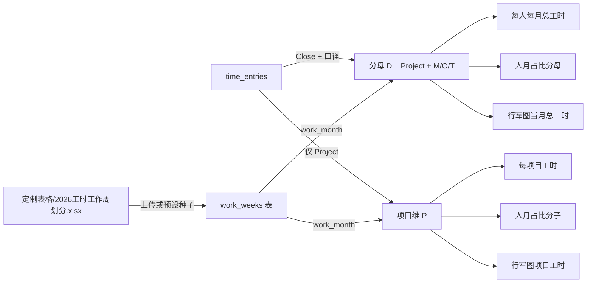

# 定制导出工时口径与工作周统一

> 承接「定制导出工时口径调整」讨论；并与 Cursor plan `定制导出工时口径调整_6efbf630` 对齐。

## 业务规则（已确认）

### 统计范围（分母 D）

以下报表在计算「员工当月总工时」「人月占比分母」「行军图当月总工时」时，**口径一致**：

- **包含**：`current_node = Close` 下的 **项目类工时** + **非项目**中 `project_name` 归一化后属于 **Management / Others / Training**（与 [`backend/crud.py`](../../../backend/crud.py) 中 `_NON_PROJECT_INCLUDE` 一致）。
- **人月占比分子、人月行军图项目格、每项目工时表中的数值**：仍为 **仅 Project** 行汇总（每项目工时表**不**增加非项目行）。

### 工作周划分（月份归属）— **统一规则**

**所有**定制化相关表格在按「月」汇总或分列时，均使用 **`定制表格/2026工时工作周划分.xlsx`** 所定义的规则：

- **运行时来源**：数据库表 **`work_weeks`**（`week_start`, `week_end`, `week_code`, `work_month`）。部署时若表为空，由后端从预设文件（与上述 Excel 同内容的 [`backend/data/work_weeks_preset.xlsx`](../../../backend/data/work_weeks_preset.xlsx)）种子导入。
- **归属逻辑**：对每条工时记录的 `start_date`，若落在某条 `work_weeks` 记录的 **`[week_start, week_end]`** 闭区间内，则计入该周的 **`work_month`**；否则退回 **`start_date` 的自然月 `YYYY-MM`**（与前端 `resolveWorkMonthKey` / 仪表盘周区间一致）。

**已按此规则实现的导出/计算：**

| 产出 | 实现位置 | 说明 |
|------|----------|------|
| 人月占比 | `get_person_month_ratio` | Close+在职；分母 Project+M/O/T；`_resolve_entry_work_month` |
| 每人每月总工时 | `get_employee_monthly_total` | 同上 |
| 人月行军图 | `get_person_month_march` | 项目格仅 Project；当月总工时为扩大分母 |
| 每项目工时（前端导出） | `buildCustomProjectHoursExport(entries, workWeeks)` | `resolveWorkMonthKey` + 传入 `workWeeks` |

### 在职过滤

- **人月占比**已使用 `_active_entry_filter()`。每人每月总工时、人月行军图在重构时与占比对齐，便于分母与「每人每月总工时」逐格对账。

---

## 数据流（概念）

---

## 实现任务（与仓库代码对应）— 已完成

1. **`backend/crud.py`**：`_resolve_entry_work_month`、`_entry_counts_toward_monthly_total`、`_custom_export_base_entries`；重构 `get_person_month_ratio`、`get_employee_monthly_total`、`get_person_month_march`。
2. **`backend/main.py`**：相关路由 docstring 已更新。
3. **`frontend/src/utils/customDataExport.js`** + **`App.jsx`**：`buildCustomProjectHoursExport(entries, workWeeks)`，`resolveWorkMonthKey`。
4. **`tests/test_custom_data_frontend.py`**：调用签名与空月 `None` 断言已对齐。

---

## 与「哪张表」的关系（简表）

| 逻辑 | 读的库表 |
|------|----------|
| 工时数值 | `time_entries` |
| 月份列 / work_month | `work_weeks`（规则源自 `定制表格/2026工时工作周划分.xlsx`） |

上传 Excel 不单独为每张导出建表；明细均在 `time_entries`，工作周在 `work_weeks`。
